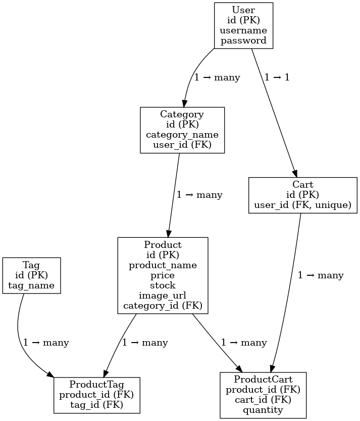

# Swap Meet React API

A fully functional RESTful API for managing users, categories, products, tags, and shopping carts. Built with Node.js, Express, Sequelize, and MySQL.  

---

## 📊 Entity–Relationship Diagram (ERD)

---

## 🚀 Features
- User authentication with JWT  
- Category + Product ownership scoped to users  
- Tagging system (many-to-many between products and tags)  
- Shopping cart with item quantities  
- Full CRUD support across all entities  
- Sequelize models with associations and alias consistency  

---

## 🛠️ Tech Stack
- Backend: Node.js, Express  
- Database: MySQL with Sequelize ORM  
- Auth: JWT-based authentication  
- Testing: Insomnia REST client  

---

## 📂 Project Structure
server/
 ├── models/        # Sequelize models
 ├── routes/        # Express routes
 ├── seeds/         # Database seeding script
 ├── config/        # DB connection
 └── server.js      # Express entry point

---

## ⚙️ Setup

1. Clone Repo
   git clone <your-repo-url>
   cd Swap-Meet-React

2. Install Dependencies
   npm install --workspaces

3. Configure Environment  
   Create a `.env` file:
   NODE_ENV=development
   DB_NAME=swapmeetreact
   DB_USER=root
   DB_PW=password
   DB_HOST=127.0.0.1
   DB_PORT=3306
   JWT_SECRET=your-secret-key

4. Setup Database
   mysql -u root -p
   DROP DATABASE IF EXISTS swapmeetreact;
   CREATE DATABASE swapmeetreact;
   EXIT;

5. Seed Database
   npm run seed --workspace server

6. Start Server
   npm run dev --workspace server  

   Server will run at:  
   http://localhost:3001/api

---

## 🧪 API Endpoints

### Users
- POST /users → Register  
- POST /users/login → Login (returns JWT)  
- GET /users/auth → Validate token  
- GET /users/basicinfo/:id → Public profile  

### Categories
- GET /categories → All categories (with products)  
- GET /categories/:id → Single category (with products)  
- POST /categories → Create category  
- PUT /categories/:id → Update category  
- DELETE /categories/:id → Delete category  

### Products
- GET /products → All user products  
- GET /products/:id → Single product  
- GET /products/by-category/:category_id → Products by category  
- POST /products → Create product  
- PATCH /products/:id → Update product  
- DELETE /products/:id → Delete product  

### Tags
- GET /tags → All tags (with products)  
- GET /tags/:id → Single tag (with products)  
- POST /tags → Create tag  

### Cart
- POST /cart → Create or return user’s cart  
- GET /cart/me → Get user’s cart (with products)  
- POST /cart/items → Add product to cart  
- DELETE /cart/items → Remove product from cart  

---

## 🧪 Testing with Insomnia
Import the provided Insomnia collection (Insomnia_2025-09-23.yaml) to test all endpoints.  

Workflow:
1. Register or log in a user  
2. Copy JWT → set as {{ accessToken }}  
3. Run category/product/cart requests  

---

## 📄 License
MIT License — free to use and modify.  
