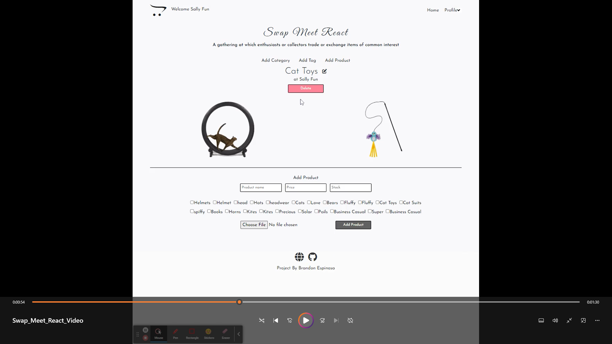

# EZ-Commerce-Duz-It
[](https://opensource.org/licenses/MIT)
[](code_of_conduct.md)

## Description 
A full stack e-commerce application fashinoned as an online flea market where users have their own shop and add items to their cart from other shops.  Users maintain their shop by adding categories, products with images, price, stock, and with tags.  Users can also update category names and product specs or remove them entirely.    

Users click a category to shop and add products to their cart.  

Shop by category or enter a users shop by clicking their shop name.

### [GitHub repository](git@github.com:espinbrandon49/swapandmeet.git)

### Tools
* Client - React, JSX, React-Router-Dom, React hooks, CSS, Formik, react-toastify, react-bootstrap, Bootstap 5, multer(middleware) 
* Server - Node.js, Express, Mysql2, sequelize, dotenv, Axios
* Authentication - JSON Web Token, bcrypt
* Deploy - Nelify and Heroku

## Table of Contents 
  * [Demo Video](#demo)
  * [Usage](#usage)
  * [Installation](#installation)
  * [Testing](#testing)
  * [License](#license)
  * [Contributing](#contributing)
  * [Collaboration](#collaboration)
  * [Questions](#questions)

## Demo
[](https://github.com/espinbrandon49/Swap-Meet-React/assets/102924713/064fdd9c-c87a-430a-822e-36906d76b27b)
  
## Usage 
Swap meet e-commerce experience where users have their own shops and carts, and search categories, or user shops to fill their shopping cart
- Add categories to organize your shop
- Shop Categories for particular desires or enter a user's shop to see all of their goods displayed
- Add products to your shop with an image, product name, price tag, number in stock, and tag
- Add tags to easily describe your product's use
- View profile to see your shop with all products displayed by category and to view your cart with selected item
- Add items to your cart with a click
- Update your shop by changing the category name, price competively, and stock number
- Delete products and categories so that your shop is always up to date

## Installation
### Application runs in the browser [here](https://jovial-belekoy-f030f6.netlify.app/category/13) 

### Cloning
Install node.js and NPM on windows, clone down the GitHub repository and install the npm packages.
1. Download and install [Node.js](https://nodejs.org/en/download/)
2. Clone the repository
```bash
https://github.com/espinbrandon49/swapandmeet
```
3. Run npm install to install the npm dependencies from each of the package.json from the [root](./package.json), [client](./client/package.json) and [server](./server/package.json) directories
```bash
npm install
```
4. Revert REST URLs to your local host - http://localhost:${PORT}

## Testing
### I used [Insomnia](https://docs.insomnia.rest/) to test my routes

## License 
### MIT License 
The content of this application is licensed under the MIT License. 

[https://choosealicense.com/licenses/mit/](https://choosealicense.com/licenses/mit/) 

## Contributing 
[Contributor Covenant](https://www.contributor-covenant.org/)

## Collaboration
To contribute, send in a pull request!

## Questions 
Contact me by [E-mail](mailto:espinbrandon49@gmail.com) or [GitHub](https://github.com/espinbrandon49)
