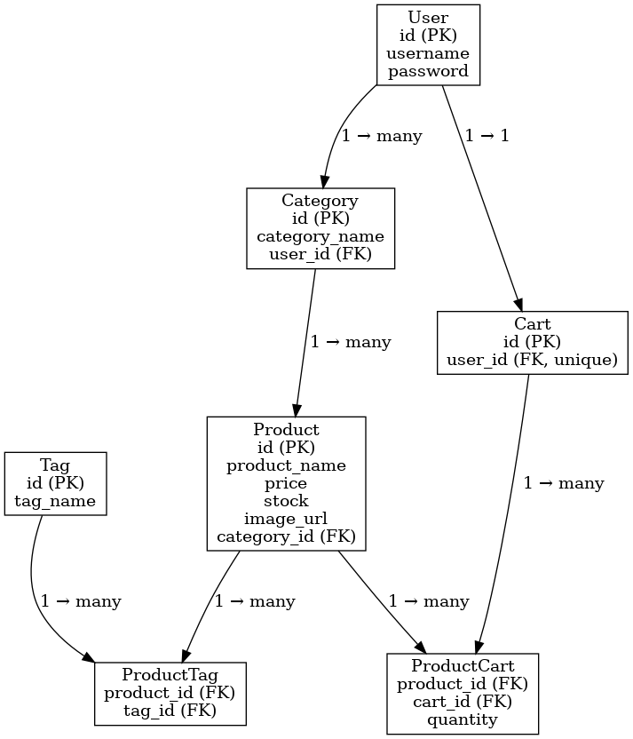

# SwapMeetReact — Marketplace MVP

SwapMeetReact is a full-stack marketplace system built to demonstrate clear user flow, structured UI architecture, and real data relationships across categories, products, and users. Rather than relying on surface-level styling alone, the app emphasizes consistency and maintainability through a defined design system and reusable components such as shared cards, headers, form shells, and loading and empty states. The frontend was intentionally refactored to reduce duplication and keep pages focused on data flow, while the backend supports scoped data access and predictable API behavior. The result is a clean, understandable application that demonstrates how a marketplace works under the hood, not just how it looks on the surface.

---

## 🎥 Demo Video (Coming Soon)
**YouTube Walkthrough:**

[Watch the 3–5 minute demo on YouTube](https://youtu.be/DEZpYes7cY8)

This video walks through the deployed Swap Meet React app, demonstrating the buyer and seller flows, key design decisions, and overall architecture.

> This video will demonstrate the full user journey:
> Home → Category → Product → Cart → Checkout (stub)
> Seller → Profile → Dashboard (CRUD)

---

## 🧭 MVP Scope (What This App Intentionally Does)

### Buyer Flow
- Browse all categories across shops
- View products by category
- View individual product pages
- Add items to cart (quantity-aware)
- View cart totals
- Trigger checkout confirmation modal (MVP stub)

### Seller Flow
- Public shop page (Profile)
- Owner-only Dashboard
- Create, edit, and delete categories
- Create, edit, and delete products
- Product ownership enforced via category ownership

### Authentication
- JWT-based authentication
- Protected routes (Cart, Dashboard)
- Auto logout on invalid/expired token

---

## 🚫 Intentional Non‑Goals (MVP Discipline)
The following features are **explicitly deferred** to preserve MVP focus:

- ❌ Image uploads (uses image URLs only)
- ❌ Cloud storage (Cloudinary / Firebase / S3)
- ❌ Payments / Stripe integration
- ❌ Reviews, ratings, or messaging
- ❌ Advanced filtering (tags scaffolded only)

> Images are stored as simple URL strings. The data model is designed to support future uploads **without schema changes**.

---

## 🧩 Tech Stack

### Frontend
- React
- React Router
- Bootstrap
- Axios

### Backend
- Node.js
- Express
- Sequelize ORM
- MySQL
- JWT Authentication

---

## 📊 Entity–Relationship Diagram (ERD)



---

## 📂 Project Structure

```
client/
 ├── src/
 │   ├── api/            # Axios client
 │   ├── helpers/        # Auth context & route guards
 │   ├── pages/          # Route-based views
 │   └── App.js

server/
 ├── models/             # Sequelize models & associations
 ├── routes/             # Express API routes
 ├── seeds/              # Database seed script
 ├── config/             # DB connection
 └── server.js           # Express entry point
```

---

## ⚙️ Local Setup

### 1. Clone Repo
```
git clone https://github.com/espinbrandon49/Swap-Meet-React.git
cd Swap-Meet-React
```

### 2. Install Dependencies
```
npm install --workspaces
```

### 3. Environment Variables
Create a `.env` file:
```
NODE_ENV=development
DB_NAME=swapmeetreact
DB_USER=root
DB_PW=password
DB_HOST=127.0.0.1
DB_PORT=3306
JWT_SECRET=your-secret-key
```

### 4. Create Database
```
mysql -u root -p
DROP DATABASE IF EXISTS swapmeetreact;
CREATE DATABASE swapmeetreact;
EXIT;
```

### 5. Seed Database
```
npm run seed --workspace server
```

### 6. Start App
```
npm run dev --workspace server
npm run dev --workspace client
```

Backend runs at:
```
http://localhost:3001/api
```

---

## 🔌 API Overview

### Users
- POST /users — Register
- POST /users/login — Login (JWT)

### Categories
- GET /categories — All categories (global)
- GET /categories/:id — Single category
- POST /categories — Create (owner)
- PATCH /categories/:id — Update (owner)
- DELETE /categories/:id — Delete (owner)

### Products
- GET /products
- GET /products/:id
- GET /products/by-category/:category_id
- POST /products — Create (owner)
- PATCH /products/:id — Update (owner)
- DELETE /products/:id — Delete (owner)

### Cart
- POST /cart — Create or fetch cart
- GET /cart/me — Get user cart
- POST /cart/items — Add item / increment
- PATCH /cart/items — Update quantity
- DELETE /cart/items — Remove item

---

## 🧪 Testing
Use **Insomnia** to test the API:
1. Login → receive JWT
2. Set `accessToken` header
3. Test category / product / cart routes

---

## 🧠 Portfolio Notes
This project prioritizes:
- Clean ownership boundaries
- Explicit MVP scoping
- Readable architecture
- Realistic product flows

It is designed as a **portfolio-quality MVP**, not a production marketplace.

---

## 📄 License
MIT License — free to use and modify.

---

**Author:** Brandon Espinosa

